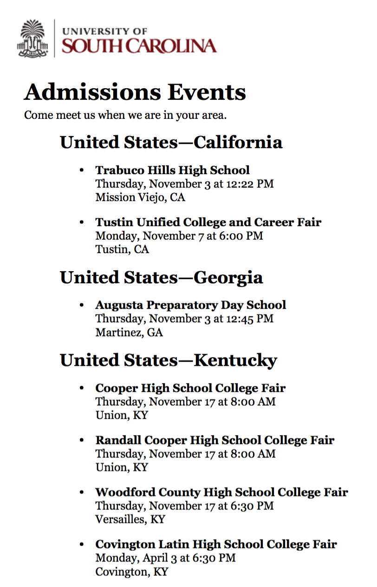

# Literature review
## Scholarship on the enrollment funnel

Most research analyzes admissions or financial aid
- Final stages of enrollment funnel

Scholarship on recruiting
- Audits of university resonse to inquiries [CITE]

- Off-campus recruiting visits
    - College perspective (Stevens, 2007)
        - important for relationships with prospects, counselors at "feeder" schools
    - Student/high school perspective (Holland, forthcoming): 
        - Which universities visit affects student decisions, especially first-generation and students of color

Research gap
- We don't know which universities visit which schools and communities
- If poor students, communities of color not being recruited, then "under-matching" may be due to under-recruiting rather than lack of guidance

<!--
---

# Background
## Scholarship on college access

Most research on access focuses on "demand side"
- Response to aid
- "under-matching": high-achieving, low-income students lack information/guidance
    - Interventions to overcome information asymmetries, nudge students

Few studies analyze recruiting

- Audits of university resonse to inquiries
- Off-campus recruiting visits
    - College perspective (Stevens, 2007): important for relationships with prospects, counselors at "feeder" schools
    - Student/high school perspective (Holland, forthcoming): Which universities visit affects student decisions, especially first-generation and students of color

Research gap

- Access depends on which universities visit your school
- We don't know which universities visit which schools
-->

---

# Theoretical motivation
## Enrollment priorities and recruiting behavior

Organizational theory

- Contingency theory (Thompson, 1967)
    - Technical level vs. managerial level
- "New" institutional theory (Meyer & Rowan, 1977)
    - Publicly adopt goals demanded by environment
    - Technical level cannot pursue all goals
    - Substantively adopt some goals (technical level)
    - Symbolically adopt others (policies, rhetoric)

Application to enrollment management

- "iron triangle" of enrollment management
    - Universities pursue three enrollment goals: access, academic profile, tuition revenue
- Recruiting is allocation of resources from technical level
    - Knowing which populations targeted by recruiting is indicator of enrollment priorities

--- &twocol

# Research design
## Overview of off-campus recruiting project

*** =left

**Data collection**

* Method
    - Web-scrape admissions websites
* Criteria to be included in data collection
    1. Post visits on admissions websites
    2. Organizational type
* Data collection sample [CRYSTAL - CHECK?]
    - 49 public research universities
    - 49 private research universities
    - 42 selective private liberal arts
* Data collection period
    - 1/1/2017 to 12/31/2017
    - Ongoing data collection with larger sample
    
*** =right

**Sample data**

---

# Research design
## Focus of the present paper

Guiding research question:
- What are the similarities and differences in off-campus recruiting patterns across public research universities?

Why this research question: 
- First paper from the larger study
- Explore behavior inductively, rather than test specific hypotheses
- Subsequent papers more focused, thematic (e.g., racial red-lining)

Why focus on public research universities:
- Historic mission of social mobility for state residents
- Decline in state funding, growth in nonresident enrollment (Jaquette &
Curs, 2015)
- What are they doing to get all these nonresident students? More effort recruiting nonresidents than residents?

--- 

# Research design
## Defining events

Off-campus recruiting events: events by paid staff or consultants focused on soliciting applications
- Event Type
    - Include: College fairs, high school visits, community college visits,
counselor events
    - Exclude: interviews, admitted or committed student events
- Event Host
    - Include: paid admissions staff or consultants (e.g. regional
    - Exclude: alumni, student volunteers
recruiters)
- Event location
    - Any off-campus location
    - E.g., high school, community college, hotel, convention center, cafe, etc.

--- 

# Research design
## Data collection, processing, quality

Data collection
- University website checked four times per year by two staff for URLs with recruiting events
- Web-scraping scripts run once per week

Data processing
- "Parsing": transform HTML text into tabular data
- "Geocoding": use Google Maps API to obtain detailed location data based on limited data
- Merge recruiting data to secondary data (e.g., school data, community data)

Data quality (are these data any good?)
- Concern 1: Are scraped events properly classified and merged to secondary data
    - Solution: manually check each scraped event
        - 8 of 15 universities checked thus far
- Concern 2: Are all events posted on admissions website
    - Solution: issue public records requests for all off-cmapus recruiting events
        - Received data from X universities; not yet incorporated

<!--
--- 

# Research design
## Secondary data

Secondary data Sources:

- NCES Common Core of Data (public high schools)
- NCES Private School University Survey (private high schools)
- U.S. Census American Community Survey (community characteristics)
- IPEDS (community colleges)
- EdFacts Initiative (public high school academic achievement)
- Equality of Opportunity Project (university income
distributions)
-->

--- 

# Research design
## Research design for analyses

Quantitative multiple case study design
- "quantitative case study": case study where quantitative data is used as the sole source of evidence (Korzilius, 2010)

Comparison to alternative research designs
- Large-N, random samplying
    - Not possible because reruiting data unavailable for random sample
    - Not desirable for our RQ because large-N designs pool results across cases
- Qualitative case study (usually collect data from multiple sources)
    - Develop more holistic view of recruiting (e.g., Stevens, 2007)
    - Less systematic analysis of particular phenomena

Data analysis
- Within-case analyses
    - Situate within local context; national overview; "deep dive" of in-state and out-of-state recruiting patterns
    - Simple descriptive statistics (e.g., counts), static visualizations, interactive maps
- Cross-case analyses

--- 

# Research design
## Analysis sample compared to population

Analysis sample consists of 15 public research universities
- Chosen based on "completeness" of recruiting event data
- Subsequent drafts may reduce sample size, based on case study principles of "purposeful sampling" (Patton, 2002)

CRYSTALL - INSERT TABLE OF SAMPLE COMPARED TO POPULATION

--- &vertical

# Deep-Dive Results

Select a university to take a closer look at the results.

<!--
select mu.univ_id, muc.univ_name, muc.univ_abbrev, mu.state_code, sd.state_name, muc.metro1, msa1.cbsa_title as metro1_name, muc.metro2, msa2.cbsa_title as metro2_name, muc.metro3, msa3.cbsa_title as metro3_name
from meta_university mu
left join state_data sd on sd.state_code = mu.state_code
left join meta_univ_classification muc on muc.univ_id = mu.univ_id
left join msa_metadata msa1 on msa1.cbsa_code = muc.metro1
left join msa_metadata msa2 on msa2.cbsa_code = muc.metro2
left join msa_metadata msa3 on msa3.cbsa_code = muc.metro3
where mu.univ_id in ('100751', '106397', '110635', '110653', '126614', '139959', '155317', '166629', '181464', '186380', '196097', '199193', '201885', '215293', '218663')
order by 2;
-->

<ul id="univ_options">
<li><a data-univ-id="199193" data-univ-name="North Carolina State University at Raleigh" data-state-name="North Carolina" data-metro1-name="Raleigh, NC" data-metro2-name="New York-Newark-Jersey City, NY-NJ-PA" data-metro3-name="Washington-Arlington-Alexandria, DC-VA-MD-WV">North Carolina State University at Raleigh</a></li><li><a data-univ-id="186380" data-univ-name="Rutgers University-New Brunswick" data-state-name="New Jersey" data-metro1-name="New York-Newark-Jersey City, NY-NJ-PA" data-metro2-name="Washington-Arlington-Alexandria, DC-VA-MD-WV" data-metro3-name="San Francisco-Oakland-Hayward, CA">Rutgers University-New Brunswick</a></li><li><a data-univ-id="196097" data-univ-name="Stony Brook University" data-state-name="New York" data-metro1-name="New York-Newark-Jersey City, NY-NJ-PA" data-metro2-name="Hartford-West Hartford-East Hartford, CT" data-metro3-name="Philadelphia-Camden-Wilmington, PA-NJ-DE-MD">Stony Brook University</a></li><li><a data-univ-id="100751" data-univ-name="University of Alabama" data-state-name="Alabama" data-metro1-name="Birmingham-Hoover, AL" data-metro2-name="Atlanta-Sandy Springs-Roswell, GA" data-metro3-name="Dallas-Fort Worth-Arlington, TX">University of Alabama</a></li><li><a data-univ-id="106397" data-univ-name="University of Arkansas" data-state-name="Arkansas" data-metro1-name="Fayetteville-Springdale-Rogers, AR-MO" data-metro2-name="Dallas-Fort Worth-Arlington, TX" data-metro3-name="Chicago-Naperville-Elgin, IL-IN-WI">University of Arkansas</a></li><li><a data-univ-id="110635" data-univ-name="University of California-Berkeley" data-state-name="California" data-metro1-name="San Francisco-Oakland-Hayward, CA" data-metro2-name="Washington-Arlington-Alexandria, DC-VA-MD-WV" data-metro3-name="Atlanta-Sandy Springs-Roswell, GA">University of California-Berkeley</a></li><li><a data-univ-id="110653" data-univ-name="University of California-Irvine" data-state-name="California" data-metro1-name="Los Angeles-Long Beach-Anaheim, CA" data-metro2-name="Las Vegas-Henderson-Paradise, NV" data-metro3-name="Seattle-Tacoma-Bellevue, WA">University of California-Irvine</a></li><li><a data-univ-id="201885" data-univ-name="University of Cincinnati" data-state-name="Ohio" data-metro1-name="Cincinnati, OH-KY-IN" data-metro2-name="Chicago-Naperville-Elgin, IL-IN-WI" data-metro3-name="Washington-Arlington-Alexandria, DC-VA-MD-WV">University of Cincinnati</a></li><li><a data-univ-id="126614" data-univ-name="University of Colorado-Boulder" data-state-name="Colorado" data-metro1-name="Denver-Aurora-Lakewood, CO" data-metro2-name="Los Angeles-Long Beach-Anaheim, CA" data-metro3-name="Chicago-Naperville-Elgin, IL-IN-WI">University of Colorado-Boulder</a></li><li><a data-univ-id="139959" data-univ-name="University of Georgia" data-state-name="Georgia" data-metro1-name="Atlanta-Sandy Springs-Roswell, GA" data-metro2-name="Los Angeles-Long Beach-Anaheim, CA" data-metro3-name="Dallas-Fort Worth-Arlington, TX">University of Georgia</a></li><li><a data-univ-id="155317" data-univ-name="University of Kansas" data-state-name="Kansas" data-metro1-name="Kansas City, MO-KS" data-metro2-name="Chicago-Naperville-Elgin, IL-IN-WI" data-metro3-name="St. Louis, MO-IL">University of Kansas</a></li><li><a data-univ-id="166629" data-univ-name="University of Massachusetts-Amherst" data-state-name="Massachusetts" data-metro1-name="Boston-Cambridge-Newton, MA-NH" data-metro2-name="New York-Newark-Jersey City, NY-NJ-PA" data-metro3-name="Los Angeles-Long Beach-Anaheim, CA">University of Massachusetts-Amherst</a></li><li><a data-univ-id="181464" data-univ-name="University of Nebraska-Lincoln" data-state-name="Nebraska" data-metro1-name="Lincoln, NE" data-metro2-name="Chicago-Naperville-Elgin, IL-IN-WI" data-metro3-name="Dallas-Fort Worth-Arlington, TX">University of Nebraska-Lincoln</a></li><li><a data-univ-id="215293" data-univ-name="University of Pittsburgh" data-state-name="Pennsylvania" data-metro1-name="Pittsburgh, PA" data-metro2-name="Chicago-Naperville-Elgin, IL-IN-WI" data-metro3-name="Washington-Arlington-Alexandria, DC-VA-MD-WV">University of Pittsburgh</a></li><li><a data-univ-id="218663" data-univ-name="University of South Carolina-Columbia" data-state-name="South Carolina" data-metro1-name="Columbia, SC" data-metro2-name="New York-Newark-Jersey City, NY-NJ-PA" data-metro3-name="Chicago-Naperville-Elgin, IL-IN-WI">University of South Carolina-Columbia</a></li>
</ul>

***

# Top Visited Metro Areas

  <table id="table-metro-count"></table>

***

# National Overview

  

    
    
  

  

    
    
  

***

# In-State Results
## State Map

<iframe id="map-state-in" width=100% height=100% allowtransparency="true"></iframe>

***

# In-State Results
## State Figures

  

    
    
    
  

  

    
    
    
  

***

# In-State Results
## Metro Area Map

<iframe id="map-metro-in" width=100% height=100% allowtransparency="true"></iframe>

***

# In-State Results
## Metro Area Figures

  

    
    
    
  

  

    
    
    
  

***

# Out-of-State Results

  

    
    
  

  

    
    
  

***

# Out-of-State Results
## Metro Area Map

<iframe id="map-metro-out-1" width=100% height=100% allowtransparency="true"></iframe>

***

# Out-of-State Results
## Metro Area Figures

  

    
    
    
  

  

    
    
    
  

***

# Out-of-State Results
## Metro Area Map

<iframe id="map-metro-out-2" width=100% height=100% allowtransparency="true"></iframe>

***

# Out-of-State Results
## Metro Area Figures

  

    
    
    
  

  

    
    
    
  

---

# Cross-University Results

  

    
    
  

  

    
    
  

---

# Conclusion

The End.

---

# References

<a href="#cite-Page_2016">[1]</a><cite>
L. C. Page and J. Scott-Clayton.
&ldquo;Improving college access in the United States: Barriers and policy responses&rdquo;.
In: <em>Economics of Education Review</em> 51 (Apr. 2016), pp. 4&ndash;22.
DOI: <a href="https://doi.org/10.1016/j.econedurev.2016.02.009">10.1016/j.econedurev.2016.02.009</a>.
URL: <a href="https://doi.org/10.1016/j.econedurev.2016.02.009">https://doi.org/10.1016/j.econedurev.2016.02.009</a>.</cite>

